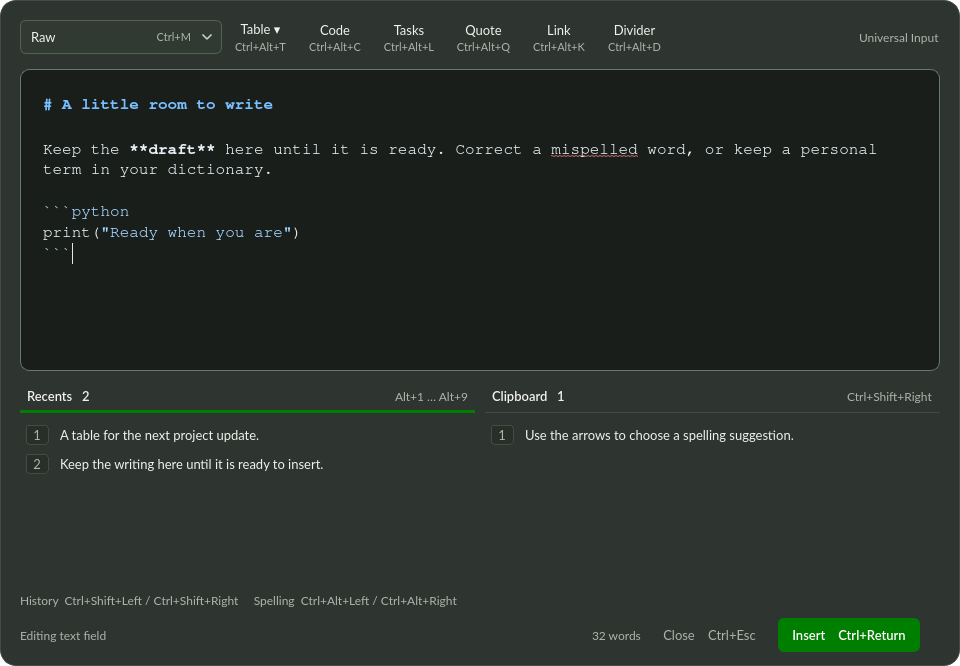

# Universal Input

A floating, keyboard-driven draft editor for **Linux/X11 applications in this Qube**.
Selecting an accessible text field opens its complete contents in a centered window,
60% of the screen width and about two-thirds of its height by default. The translucent, frameless window can be moved by dragging its command bar
and resized from its bottom-right grip. Nothing is written back until **Ctrl+Enter**.
**Ctrl+Escape** or a quick double **Escape** closes and saves the draft to Recents, without a prompt.
A single **Escape** dismisses an open picker or spelling popup and keeps the draft open.

The editor uses X11 `override_redirect`, so i3 does not tile, reparent, or decorate
it. Dragging and resizing are handled by the app. No i3 rule is required with the
standard Qubes GUI settings; Qubes can still draw its trusted VM-colour border.
A dom0 policy that explicitly disables override-redirect windows can override this
request. This app does not change dom0 policy.

The interface uses a dark translucent panel with **#007e00** highlights, Lato controls,
Nimbus Mono PS text in both Raw and Rendered modes. Font fallbacks apply
where those fonts are unavailable. Transparency depends on the desktop compositor.



## Run

On Debian 13 (the dependencies are already installed in this development Qube):

```sh
./scripts/install-deps
./scripts/run
```

Use `./scripts/run --demo` to try the editor without monitoring applications or writing
history. To restart a running desktop instance manually:

```sh
pkill -TERM -f '^/usr/bin/python3 -m universal_input$'
sleep 1
./scripts/run
```

`./scripts/install-desktop` adds an application-menu launcher. To also start
at login, run `./scripts/install-desktop --autostart`.

The tray menu can pause automatic opening, clear history, or quit. After cancelling
or inserting, the original field is suppressed until focus moves elsewhere; use
**Ctrl+Space** to reopen it immediately. Only one desktop instance runs at a time.

## Editing and inserting

The **top-left dropdown** selects the draft view independently of the target:

- **Raw** shows and edits literal Markdown source with Pygments syntax highlighting, including recognised fenced code languages.
- **Rendered** shows an editable formatted document, including tables.

Switching views without making edits preserves the raw source exactly. Editing the
rendered document uses Qt's Markdown serializer when returning to Raw or inserting;
spacing and Markdown syntax may be normalized. Switching views resets Qt's undo stack.

At insertion, the clipboard temporarily offers **HTML to rich editors** and **Markdown
to plain editors**. The receiving application chooses the format it supports. The app
selects the original field's complete contents through accessibility and pastes once,
then checks the resulting text. It never simulates Enter into the target. The previous
clipboard is restored if another application has not replaced it in the meantime.
A changed, closed, inaccessible, or incorrectly focused target leaves the draft open.

| Shortcut | Action |
| --- | --- |
| Ctrl+Enter | Replace the entire original field |
| Esc | Dismiss suggestions or the table picker; keep the selected word |
| Ctrl+Esc / double Esc | Save the draft to Recents and close without changing the field |
| Ctrl+Space | Open the current field; use Select All and Copy if accessibility is unavailable |
| Ctrl+1 / Ctrl+2 | Raw / Rendered |
| Ctrl+M | Toggle Raw / Rendered (Ctrl+Shift+M also works) |
| Ctrl+B / Ctrl+I | Toggle bold / italic |
| Ctrl+U | Underline in rendered mode; `__bold__` in Raw (Markdown has no standard underline) |
| Ctrl+Shift+X | Strikethrough |
| Ctrl+\` | Inline code |
| Ctrl+Alt+Left / Ctrl+Alt+Right | Select the previous / next misspelled word |
| Ctrl+Left / Ctrl+Right | Move the cursor one word at a time |
| Ctrl+Shift+Left / Ctrl+Shift+Right | Highlight Recents / Clipboard history |
| Alt+1 … Alt+9 | Choose a spelling popup item, or insert that numbered history item when no popup is open |
| Alt+Enter | Reopen suggestions for a selected misspelled word |
| Alt+A | Add the selected misspelled word to the personal dictionary |
| Ctrl+Shift+Plus / Ctrl+Shift+Minus | Increase / decrease editor font size; saved immediately |
| Ctrl+Alt+T | Open the table size grid |
| Ctrl+Alt+C / Ctrl+Alt+L | Code block / task list |
| Ctrl+Alt+Q / Ctrl+Alt+K / Ctrl+Alt+D | Quote / link / divider |
| Ctrl+Z / Ctrl+Y | Undo / redo within the current view |

The top toolbar inserts **tables, fenced code, task lists, quotes, links, and dividers**.
Templates insert at the current cursor and select their useful placeholder, such as
the code body, first task, link label, or first table header. Typing replaces it immediately.
The mode selector and toolbar buttons show their configured shortcuts.
The Table dropdown opens a 10-column × 8-row grid inside the editor. Hover over cells
to preview the dimensions, then click to insert; arrow keys and Enter also work.
The first row is the header. Click elsewhere or press Escape to dismiss the picker.
Press Ctrl+Escape or double Escape to save and close the entire draft. Larger tables can be expanded using the row/column
controls. The picker uses no modal dialog or separate native window.
Rendered tables have faint, roughly 10% opacity cell borders. Hover over a
cell to show green row/column insertion guides. Click the **+** on the right to insert
a row below that cell, or the **+** above to insert a column to its right. Hover near
the first row's top edge or first column's left edge to insert before them. Row/column
changes are undoable and survive conversion back to Markdown.

## Spelling and font size

Local Enchant/Hunspell checking underlines misspelled prose in both views. Code,
URLs, email addresses, and Markdown link destinations are skipped. Select an
underlined word (double-click, or Ctrl+Alt+Left/Right) to open its suggestions. Use the
arrow keys and Enter, click an item, or use its displayed Alt+number shortcut.
Press **Alt+A**, or choose the final “Add to dictionary” item, to save a personal word
for future sessions. This action has its own shortcut instead of an Alt+number slot.
Typing replaces the selected misspelling immediately; the popup keeps keyboard focus
in the editor. **Escape** dismisses suggestions and leaves the word selected.
**Ctrl+Escape**, or two Escape presses within 400 milliseconds, saves and closes the
whole editor. Typing or clicking between Escape presses resets that double-press sequence.

The default language is Australian English (`en_AU`). Set `spellcheck_language` to
another installed Enchant dictionary if needed. Install its corresponding Hunspell
language package first. No text is sent to a server. Spelling underlines and Raw
syntax colours are display-only and are not inserted into the target.

Ctrl+Shift+Plus and Ctrl+Shift+Minus change the editor's base font size by one pixel,
from 10 to 48. The size applies in both views and saves immediately in `config.json`;
reopening the draft or restarting the app restores it. Shifted `=` / `_` spellings
are included as shortcut aliases for keyboard layouts that need them.

## Persistent history and configuration

The two lists below the editor contain closed or successfully inserted drafts (left) and copied
text (right). Click an item or use the history shortcuts to insert at the draft cursor,
replacing any selected draft text. History insertion does not touch the target field.

Files live in **`~/.config/universal-input/`**, or
`$XDG_CONFIG_HOME/universal-input/` when set:

- `config.json`: retained entry counts, all application keybindings, spelling language, and editor font size.
- `history.json`: both histories, newest first, including rich clipboard data when available.
- `personal-dictionary.txt`: your added words, one per line. Clearing history keeps this dictionary.

The app fills in all default settings and keybindings on startup. See
[`config.example.json`](config.example.json) for the complete defaults. For example,
these overrides change the mode shortcut and disable bold:

```json
{
  "recent_entries_limit": 50,
  "clipboard_entries_limit": 50,
  "spellcheck_language": "en_AU",
  "editor_font_size": 16,
  "window_width_percent": 60,
  "window_height_percent": 66.67,
  "keybindings": {
    "toggle_mode": "F6",
    "bold": ""
  }
}
```

Use a Qt shortcut string (`"Ctrl+Alt+T"`), a list of aliases (`["F6", "Ctrl+M"]`),
or `""` / `[]` to disable a binding. Missing actions inherit their defaults.
Unknown actions, invalid shortcuts, and shortcuts assigned to multiple actions
produce a configuration error. The `open` action controls the global shortcut;
`choice_1` through `choice_9` are shared by history and spelling suggestions.
The `close`, `dismiss_popup`, and `add_to_dictionary` actions control Ctrl+Escape,
Escape, and Alt+A respectively. Double-pressing the configured `dismiss_popup` key
closes the editor as well.
Standard text editing and widget navigation (typing, selection, arrows, undo/redo)
continue to use Qt's usual keys. Shortcut hints follow your configuration.

`window_width_percent` and `window_height_percent` set the centered window size as
percentages of the available screen (20–100). The minimum size needed to fit controls
still applies. These settings are loaded at startup and applied when a draft opens.

Set either limit to an integer from **0 to 500**; zero disables that history. Restart
the app after changing configuration. Reduced limits trim the saved history on the
next launch. The first nine items have Alt+number shortcuts; the rest can be scrolled
and clicked. Repeated text moves to the top instead of creating duplicates.

History is saved atomically, with owner-only directory/file permissions (`0700`/`0600`).
It is local, unencrypted JSON. Empty entries and text over 100,000 characters are not
retained. Password fields are excluded from automatic editing, but text explicitly
copied to the system clipboard is eligible for clipboard history. Use **Clear history**
in the tray menu to remove both saved lists. Malformed history files are preserved as
`history.invalid-<timestamp>.json`; invalid configuration is reported without overwriting it.
Closing with Ctrl+Escape, double Escape, the Close button, or Quit saves the current draft to Recents.
During the same session, reopening the same accessible field restores its saved draft,
view mode, and cursor if the underlying field is unchanged. If the field has changed,
its current contents are loaded instead; the old draft remains in Recents. Field-to-draft
associations are memory-only (up to 50 fields); Recents persist across restarts.
If history retention is disabled or the draft exceeds the size limit, it remains eligible
for same-session field restoration but is not persisted in Recents. Active drafts are not
continuously saved against a crash.

## Current integration limits

- X11 and applications exposing editable **AT-SPI accessibility** objects are required.
  This is not yet a hook into every possible custom-drawn input widget. Some browser,
  Electron, terminal, remote-desktop, and sandboxed controls do not expose usable fields.
  **Ctrl+Space** also works without accessibility: it sends Ctrl+A then Ctrl+C to
  load existing text, restoring the previous clipboard afterwards. At insertion it
  selects all again and replaces that field. If copying fails (including some empty
  fields), it opens a blank draft and reports that insertion uses the current selection.
  This fallback requires ordinary editing shortcuts; the original window is checked,
  but same-field identity, changes made while drafting, and insertion success cannot
  be verified. Automatic same-field draft restoration is unavailable in this fallback.
- Only this Qube is supported. There is no dom0 integration or cross-Qube transport.
  A future design can reuse the editor with a target adapter per Qube; it would need
  an explicit transport and focus-routing design.
- AT-SPI imports all exposed text and basic bold/italic/underline/strike attributes.
  Existing complex rich documents (links, embedded media, table structure, application-
  specific styling) are not faithfully reconstructed by this first adapter. New tables
  created in the draft export as Markdown and HTML.
- Paste-format selection is controlled by the destination application. Apps that strip
  HTML, normalize text, reject accessibility selection, or do not implement normal
  Ctrl+V may need a dedicated adapter. Verification checks text, not rich-style fidelity.
  On an unverified transfer, inspect the original field before retrying.
- A single-line target cannot hold a multiline document. App-side normalization is
  reported as an unverified insertion rather than silently accepting different content.
- The editor handles up to one million source characters. It does not capture keystrokes
  typed into the original field during the short interval before a focus event is received.

## Development

```sh
sudo apt-get install --no-install-recommends python3-pytest xvfb xauth dbus-daemon
./scripts/test -q
```

Desktop integration tests use an isolated Xvfb display, D-Bus session, and disposable
Qt target application; they never paste into the user's applications. The tests cover
focus detection, field loading, draft isolation, cancellation, password/read-only
exclusion, hotkeys, rich/Markdown transfer, clipboard restoration, external edits,
clearing a field, persistent history retention, Escape draft recovery, view conversion,
table row/column insertion and hover access, syntax highlighting, spelling suggestions,
personal dictionary persistence, configurable shortcuts, and font-size persistence.

`editor.py`/`design.py` own the UI; `tables.py` owns hover controls; `history.py`/`storage.py` own
retention; `accessibility.py` and `x11.py` provide the Linux adapter; `app.py` coordinates
capture and explicit insertion. No web service is used.

References: [AT-SPI](https://gnome.pages.gitlab.gnome.org/at-spi2-core/libatspi/),
[Qt text editing](https://doc.qt.io/qt-6/qtextedit.html),
[Qt clipboard MIME data](https://doc.qt.io/qt-6/qmimedata.html).
