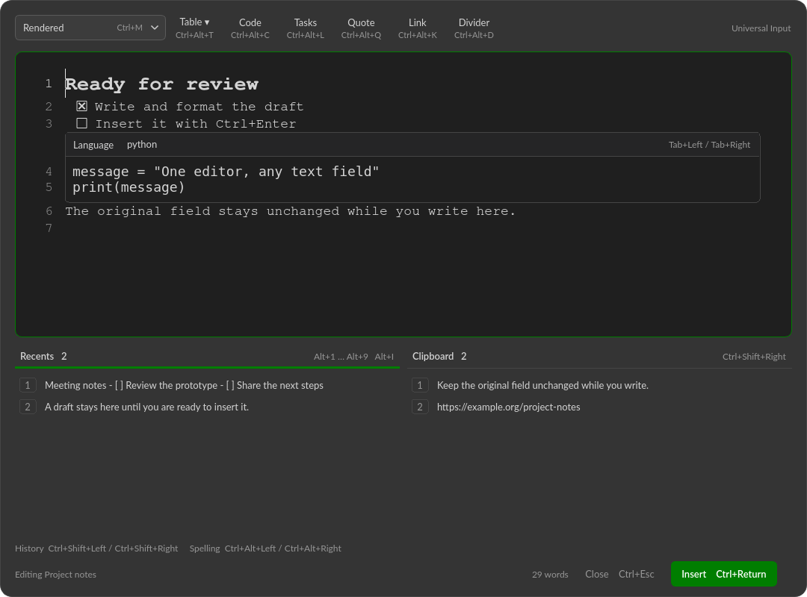
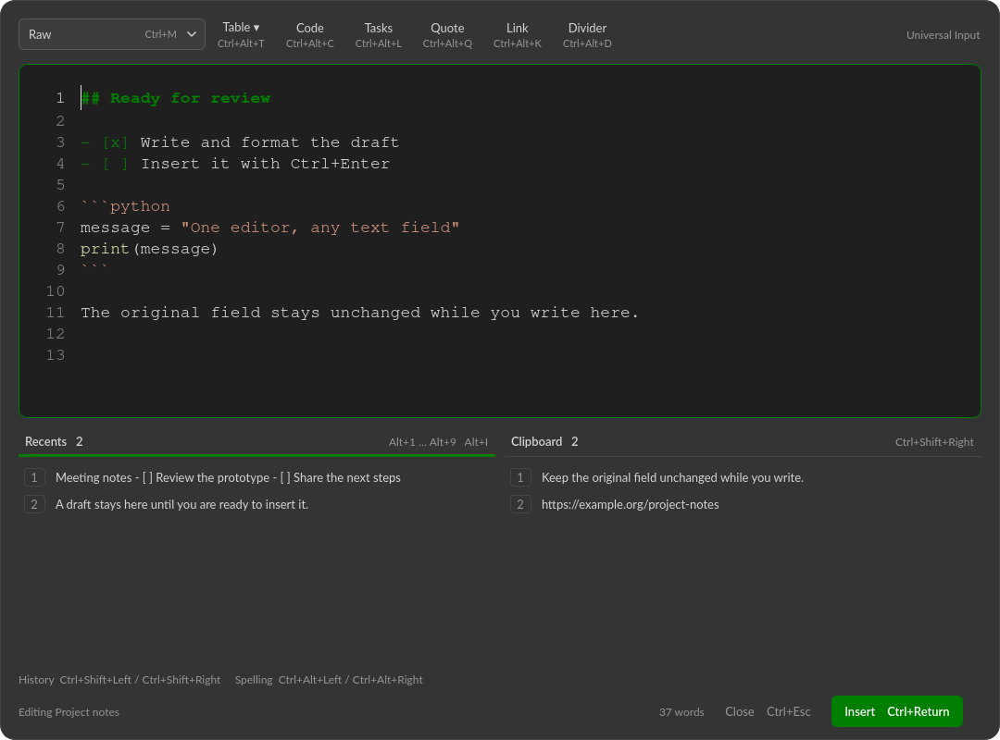
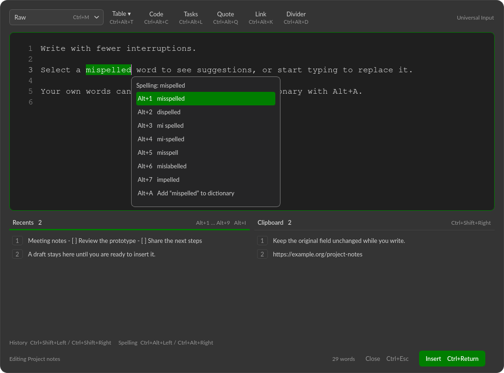
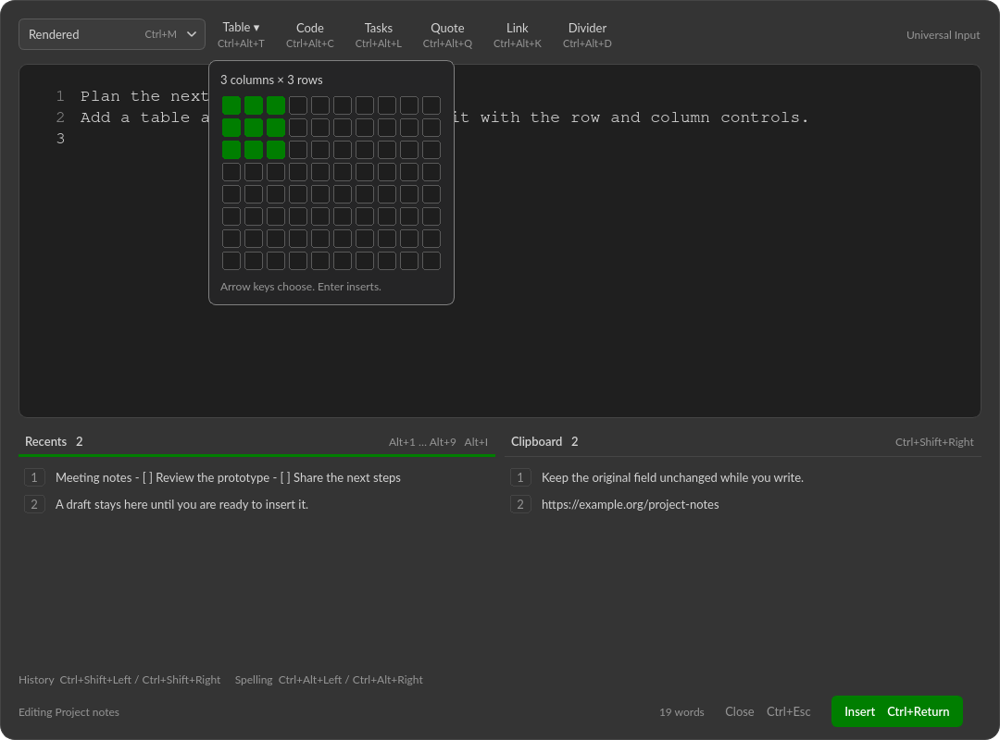

# Universal Input

A floating, keyboard-driven editor for text fields on your Linux desktop.
Write in Markdown or an editable rendered view, reuse recent drafts and clipboard
entries, and send the result back when you are ready. **The original field stays
unchanged until you press Ctrl+Enter.**



Built for **Linux/X11**, including an individual **Qubes OS Qube**. This is an early
release, tested on Debian 13. Field detection depends on accessibility support;
**Ctrl+Space** provides a manual fallback. Wayland and cross-Qube editing are not
supported yet.

## Try it

Run these commands inside the desktop session where you want to edit text. On
Qubes OS, install in the application Qube, **not dom0**.

```sh
git clone https://github.com/muntedcrocodile/universal_input.git
cd universal_input
./scripts/install-deps
./scripts/run --demo
```

The dependency installer uses Debian's `apt` and asks for `sudo`. It installs Python,
PyQt6, AT-SPI, Xlib, Pygments, Enchant, and the Australian English spelling dictionary.
Python 3.11 or later is required. In a template-based Qube, install dependencies in
its TemplateVM so they survive a Qube restart; keep this checkout in the AppVM's home
directory. Other distributions need the equivalent packages.

Demo mode uses sample-free, in-memory drafts. It does not monitor applications,
read the system clipboard, or save history. Close it with **Ctrl+Escape**.
Then start desktop integration:

```sh
./scripts/run
```

## Start automatically

Quit any manually started instance using its tray menu, then run:

```sh
./scripts/install-service
./scripts/install-desktop
```

This installs and enables a **systemd user service**, starts it now, and adds a
login hook to supply the X11 display environment. The second command adds an
application-menu launcher. No root service or lingering user session is needed.
The service template is in [packaging/systemd](packaging/systemd/universal-input.service.in).

```sh
systemctl --user status universal-input
systemctl --user restart universal-input
journalctl --user -u universal-input -n 50
```

The service restarts after an unexpected failure; choosing **Quit** stops it until
you start it again or log in again. The checkout must stay at its installed path.
After moving it, rerun `./scripts/install-service`. To update:

```sh
git pull --ff-only
./scripts/install-service
```

To turn automatic startup off and stop the app:

```sh
systemctl --user disable --now universal-input
rm -f "${XDG_CONFIG_HOME:-$HOME/.config}/autostart/universal-input.desktop"
```

## From a field to a finished draft

1. **Select a text field.** Accessible fields open automatically. Otherwise, press
   **Ctrl+Space**; the fallback uses Select All and Copy to load the field.
2. **Write in the floating editor.** Switch between **Raw** and **Rendered** with
   **Ctrl+M**. Your draft is separate from the original field.
3. **Press Ctrl+Enter to insert.** The app replaces the field's contents. The
   clipboard offers Markdown to plain editors and HTML to rich editors; the
   destination chooses which format to accept.

**Ctrl+Escape**, or two quick **Escape** presses, saves the draft to Recents and
closes without changing the field. One Escape dismisses an open popup. Reopening
the same accessible, unchanged field restores its draft during the current session.
The tray menu can pause automatic opening, clear histories, or quit.

## One place to write

- **Raw and Rendered views.** Syntax-highlighted Markdown source, editable formatted
  text, fenced code with language headers, tasks, links, quotes, and tables.
- **Keyboard navigation.** Hold Tab and press Left/Right to select useful parts:
  a code block's language and body, a link's label and URL, tasks, or table cells.
- **Line tools.** A muted line-number gutter, Ctrl+L to select a whole line, Ctrl+G
  to jump to a line, and Ctrl+[ / Ctrl+] to indent selected blocks.
- **Local spelling.** Ctrl+Alt+Left/Right selects misspellings. Arrows and Enter
  choose a correction; Alt+A adds a word to your persistent personal dictionary.
  Typing replaces the selected word immediately.
- **Two history lists.** Ctrl+Shift+Left/Right highlights Recents or Clipboard.
  Alt+1–9 inserts an item; Alt+I accepts any retained item's number.
- **A floating workspace.** Frameless and translucent, with monospace editing and
  neutral dark colours accented in `#007e00`. Drag the toolbar to move it; use the
  bottom-right grip to resize. It bypasses tiling window management, including i3.

### Write source or edit the result

Raw view uses Pygments highlighting for Markdown and recognised code languages.
The toolbar shows the configured shortcuts; inserted templates select their first
useful placeholder so you can type immediately.



### Correct words without leaving the draft

Suggestions keep typing focus in the editor. Escape dismisses the popup and leaves
the word selected; personal dictionary entries persist across sessions.



### Insert and grow tables

Choose a size from the Table grid. In Rendered view, hover over a cell to reveal
**+** controls for adding rows and columns. These changes support undo.
For larger tables, choose **Custom size…** (or press **C** in the grid). The entry
popup asks for rows, including the header, then columns.



## Settings and shortcuts

Settings live in `~/.config/universal-input/config.json`, or
`$XDG_CONFIG_HOME/universal-input/config.json`. Defaults are created on the first
normal launch. [config.example.json](config.example.json) lists every setting and
binding.

| Setting | Default |
| --- | --- |
| Recent drafts / clipboard entries retained | 50 each; configurable from 0 to 500 |
| Window width / height | 60% / 66.67% of the available screen |
| Editor font size | 16 px; Ctrl+Shift+Plus/Minus saves changes immediately |
| Indentation | 4 spaces |
| Spelling dictionary | `en_AU` |
| App keybindings | Configurable, with aliases or disabled bindings |

Restart the service after editing the config file. The **[usage guide](docs/usage.md)**
contains the complete shortcut table, configuration examples, navigation details,
and transfer behaviour.

## Data and compatibility

Draft history, clipboard history, and the personal dictionary stay on this machine.
There is no cloud service, account, telemetry, or network spellchecker. History is
**unencrypted local data** with owner-only file permissions. Password fields are
excluded from automatic opening, but explicitly copied text can enter clipboard
history. Set a history limit to `0` to disable that list, or clear both lists from
the tray menu. Active drafts are saved on close/insert, not continuously against a
crash.

Automatic detection needs editable AT-SPI objects. Some browser, Electron,
terminal, remote-desktop, or custom controls do not expose usable fields. The
Ctrl+Space fallback requires ordinary Ctrl+A/C/V behaviour and cannot verify the
identity or contents of a particular field. If copy fails, the editor opens blank
and reports that insertion uses the current selection.

Complex existing rich documents are not imported losslessly. Editing in Rendered
view can normalize Markdown syntax; switching views resets undo history. A
single-line target cannot accept a multiline document. Review an unverified
insertion before retrying. More details are in the
[integration limits](docs/usage.md#current-integration-limits).

In Qubes OS, the app only sees its own Qube. No dom0 policy changes are made; Qubes
may retain its trusted VM-colour border. Transparency depends on the compositor.

## Development

```sh
sudo apt-get install --no-install-recommends python3-pytest xvfb xauth dbus-daemon
./scripts/test -q
```

Tests use an isolated Xvfb display, D-Bus session, and disposable target app. They
cover capture, explicit insertion, clipboard restoration, draft recovery, editing,
formatting, spelling, navigation, and configuration without pasting into your apps.

To regenerate the screenshots using only synthetic sample text:

```sh
xvfb-run -a -s '-screen 0 1800x1200x24' ./scripts/screenshots
```

The UI lives in `editor.py`, `design.py`, and the editing helpers; `app.py`
coordinates capture and insertion. `accessibility.py` and `x11.py` provide desktop
integration; `storage.py` owns configuration and persistence.
[Report a bug or suggest a change](https://github.com/muntedcrocodile/universal_input/issues).

## License

Copyright © 2026 muntedcrocodile. Licensed under the
**GNU Affero General Public License, version 3 or later (AGPL-3.0-or-later)**.
See [LICENSE](LICENSE) for the full terms. Dependencies retain their own licenses.

The palette draws from [VS Code Dark](https://github.com/microsoft/vscode/blob/main/extensions/theme-defaults/themes/dark_vs.json)
and [Dark+](https://github.com/microsoft/vscode/blob/main/extensions/theme-defaults/themes/dark_plus.json),
with green replacing blue accents. The UI uses Lato and Nimbus Mono PS when
available, with system font fallbacks.
